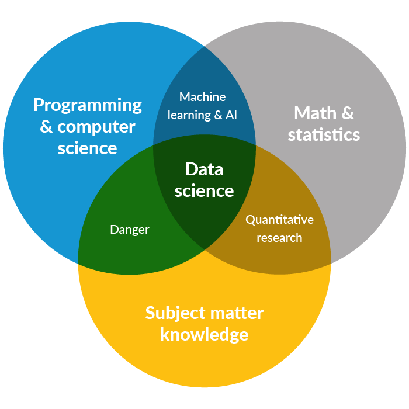
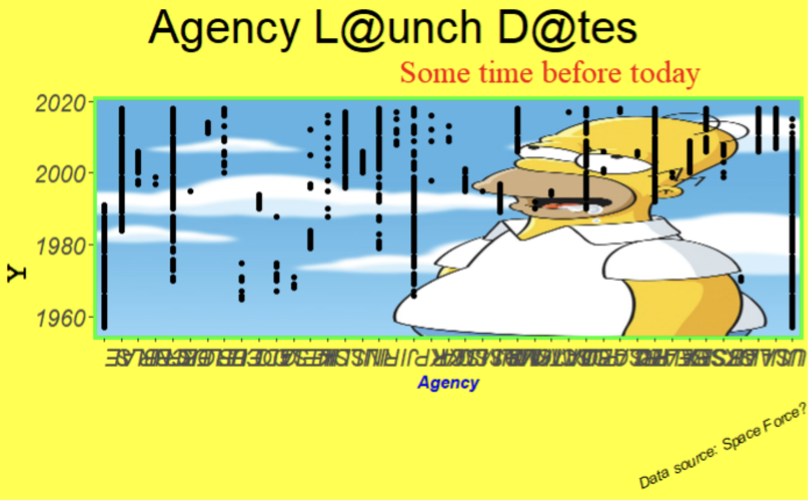
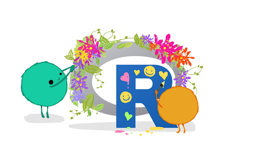
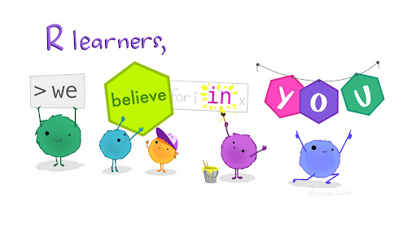

```{r setup, include=FALSE}
options(htmltools.dir.version = FALSE)
library(emo)
library(tidyverse)
```

```{r xaringan-themer, include=FALSE, warning=FALSE}
library(xaringanthemer)
style_duo(
  primary_color = "#4e344e",
  secondary_color = "white",
  link_color = "#ffcdff",
  header_font_google = google_font("Gowun Batang"),
  text_font_google   = google_font("Assistant", "300", "300i"),
  code_font_google   = google_font("Roboto Mono"),
  text_font_size = "1.5rem",
  title_slide_background_image = "r_first_then.png",
  title_slide_background_size = "40%",
  title_slide_background_position = "right",
  title_slide_background_color = "white",
  title_slide_text_color = "#4e344e", 
  inverse_link_color = "#a824a8"
)
```

# 4-3-2-1...go outline!

- ### `r emo::ji("four")` strategies to welcome hesitant students

- ### `r emo::ji("three")` tools to make your life easier 

- ### `r emo::ji("two")` platforms to minimize installation barriers

- ### `r emo::ji("one")` lesson learned 

---

class: inverse, center, middle

# `r emo::ji("four")` strategies to welcome hesitant students

---

## First interaction with R?

```{r}
vec <- c(1, 5, 10, 20)

vec[2]
```

```{r}
sequence <- seq(from = 1, to = 5, by = 1)

sequence * 4
```

```{r}
calc_volume <- function(moles, R, temp, pressure) {
  (moles * R * temp) / pressure 
}
```

## `r emo::ji("vomit")`

---

## Create early wins

- A cool visualization they can customize
- Low-effort, high-impact updates in R Markdown

---

class: left, middle

"On the first day of the course...students are presented with a fully functional R Markdown document...that they can knit to produce an in-depth data visualization. Then, **by updating just one parameter in the R Markdown document, they can produce a new report with a new data visualization**."

.footnote[
From [A Fresh Look at Introductory Data Science](https://www.tandfonline.com/doi/full/10.1080/10691898.2020.1804497) by Mine Cetinkaya-Rundel and Victoria Ellison in the Journal of Statistics and Data Science Education (Vol. 29, 2021).
]

---

class: inverse

## 2. Engage more students with creative activities

```{r, out.width = "50%", fig.align = "center", echo = FALSE}

```


---

class: center, top, inverse

```{r, out.width = "45%", echo = FALSE}

```

.footnote[
From the [Data Science at the Urban Institute](https://urban-institute.medium.com/what-is-data-science-the-urban-institute-b5e4b3ff9cc2)
]

---

### Do your data viz worst

```{r, echo = FALSE, out.width = "60%", echo = FALSE, fig.align = "center", fig.cap = "By Jessica West, Bren MESM Class of 2023"}

```

---
```{r eval = FALSE}
ggplot(data = space, aes(x = agency, y = launch_year)) +
  annotation_custom(rasterGrob(img, width = unit(1,"npc"), height = unit(1,"npc")), 
                    -Inf, Inf, -Inf, Inf) +
  geom_point() +
  theme(
    plot.background = element_rect(fill = "yellow"),
    plot.title = element_text(size = 30, hjust = 0.25),
    plot.subtitle = element_text(size = 20, hjust = 0.75, color = "red", family = "serif"),
    plot.caption = element_text(size = 10, face = "italic", angle = 25),
    axis.title.x = element_text(face = "bold.italic", color = "blue"),
    axis.title.y = element_text(family = "mono", face = "bold", size = 20, hjust = 0.25),
    axis.text = element_text(face = "italic", size = 15),
    axis.text.x.bottom = element_text(angle = 180),
    panel.background = element_rect(fill = 'lightblue', colour = 'darkred', size = 4),
    panel.border = element_rect(fill = NA, color = "green", size = 2),
    panel.grid.major.x = element_line(color = "purple", linetype = 2),
    panel.grid.minor.x = element_line(color = "orange", linetype = 3),
    panel.grid.minor.y = element_blank(),
    strip.background = element_rect(fill = "magenta"),
    strip.text.y = element_text(color = "white"),
    strip.placement = "outside") +
  labs(x = "Agency", 
       y = "Y", 
       title = "Agency L@unch D@tes",
       subtitle = "Some time before today",
       caption = "Data source: Space Force?")
```

---

### Create artwork with an existing package

For example, Danielle Navarro's {flametree} package:


.footnote[
See Danielle's summary of [generative art packages for R](https://blog.djnavarro.net/posts/2021-10-19_rtistry-posts/)
]

---

```{r}

library(flametree)

# pick some colours
shades <- c("antiquewhite", "coral", "cyan4", "goldenrod")

# data structure defining the trees
dat <- flametree_grow(time = 7, trees = 15)

# draw the plot
p <- dat %>% 
  flametree_plot(
    background = "gray10",
    palette = shades, 
    style = "nativeflora"
  )

```


---

class: inverse, center

```{r, echo = FALSE, fig.width = 12}
p
```


---

### Draw a cartoon or storyboard of a function


---

class: inverse

## 3. Help them build a kitchen that feels good

```{r, out.width = "60%", fig.align = "center", echo = FALSE}

```

---

### Minimal effort, big impact ideas:

- Update IDE theme
- R Markdown + visual editor
- Rainbow parentheses
- R Projects
- Don't underestimate the challenge of file paths

---

## 4. Write code together

- You type & explain, then they type - line by line
- Bring annotated key for yourself
- Have keys available before and after for everyone

---

## 3 tools that might make your life easier

- {xaringan} for slides
- GitHub Pages to share keys
- {distill} for sturdy, simple websites

---

class: center, middle

# xaringan

### /ʃaː.'riŋ.ɡan/

---

class: inverse, center, middle

## 2 tools to avoid installation barriers

- {learnr}
- RStudio Cloud

---

## learnr tutorials

---

## RStudio Cloud

https://datasciencebox.org/access-r.html

---

## `r emo::ji("one")` big lesson learned

### Encouragement is teaching. 

```{r, echo = FALSE, out.width = "70%", fig.align = "center"}

```

---

# Some Tips


.pull-left[
An example using a leading `*`:

    ```r
    if (TRUE) {
    ** message("Very important!")
    }
    ```
Output:
```r
if (TRUE) {
* message("Very important!")
}
```

This is invalid R code, so it is a plain fenced code block that is not executed.
]

.pull-right[
An example using `{{}}`:

````
`r ''````{r tidy=FALSE}
if (TRUE) {
*{{ message("Very important!") }}
}
```
````
Output:
```{r tidy=FALSE}
if (TRUE) {
{{ message("Very important!") }}
}
```

It is valid R code so you can run it. Note that `{{}}` can wrap an R expression of multiple lines.
]

---

# Some Tips

An example of using the trailing comment `#<<` to highlight lines:

````markdown
`r ''````{r tidy=FALSE}
library(ggplot2)
ggplot(mtcars) + 
  aes(mpg, disp) + 
  geom_point() +   #<<
  geom_smooth()    #<<
```
````

Output:

```{r tidy=FALSE, eval=FALSE}
library(ggplot2)
ggplot(mtcars) + 
  aes(mpg, disp) + 
  geom_point() +   #<<
  geom_smooth()    #<<
```

---

# Some Tips

When you enable line-highlighting, you can also use the chunk option `highlight.output` to highlight specific lines of the text output from a code chunk. For example, `highlight.output = TRUE` means highlighting all lines, and `highlight.output = c(1, 3)` means highlighting the first and third line.

````md
`r ''````{r, highlight.output=c(1, 3)}
head(iris)
```
````

```{r, highlight.output=c(1, 3), echo=FALSE}
head(iris)
```

Question: what does `highlight.output = c(TRUE, FALSE)` mean? (Hint: think about R's recycling of vectors)

---

# Some Tips

- To make slides work offline, you need to download a copy of remark.js in advance, because **xaringan** uses the online version by default (see the help page `?xaringan::moon_reader`).

- You can use `xaringan::summon_remark()` to download the latest or a specified version of remark.js. By default, it is downloaded to `libs/remark-latest.min.js`.

- Then change the `chakra` option in YAML to point to this file, e.g.

    ```yaml
    output:
      xaringan::moon_reader:
        chakra: libs/remark-latest.min.js
    ```

- If you used Google fonts in slides (the default theme uses _Yanone Kaffeesatz_, _Droid Serif_, and _Source Code Pro_), they won't work offline unless you download or install them locally. The Heroku app [google-webfonts-helper](https://google-webfonts-helper.herokuapp.com/fonts) can help you download fonts and generate the necessary CSS.

---

# Macros

- remark.js [allows users to define custom macros](https://github.com/yihui/xaringan/issues/80) (JS functions) that can be applied to Markdown text using the syntax `![:macroName arg1, arg2, ...]` or ``. For example, before remark.js initializes the slides, you can define a macro named `scale`:

    ```js
    remark.macros.scale = function (percentage) {
      var url = this;
      return '';
    };
    ```

    Then the Markdown text

    ```markdown
    
    ```

    will be translated to
    
    ```html
    
    ```

---

# Macros (continued)

- To insert macros in **xaringan** slides, you can use the option `beforeInit` under the option `nature`, e.g.,

    ```yaml
    output:
      xaringan::moon_reader:
        nature:
          beforeInit: "macros.js"
    ```

    You save your remark.js macros in the file `macros.js`.

- The `beforeInit` option can be used to insert arbitrary JS code before `remark.create()`. Inserting macros is just one of its possible applications.

---

# CSS

Among all options in `xaringan::moon_reader`, the most challenging but perhaps also the most rewarding one is `css`, because it allows you to customize the appearance of your slides using any CSS rules or hacks you know.

You can see the default CSS file [here](https://github.com/yihui/xaringan/blob/master/inst/rmarkdown/templates/xaringan/resources/default.css). You can completely replace it with your own CSS files, or define new rules to override the default. See the help page `?xaringan::moon_reader` for more information.

---

# CSS

For example, suppose you want to change the font for code from the default "Source Code Pro" to "Ubuntu Mono". You can create a CSS file named, say, `ubuntu-mono.css`:

```css
@import url(https://fonts.googleapis.com/css?family=Ubuntu+Mono:400,700,400italic);

.remark-code, .remark-inline-code { font-family: 'Ubuntu Mono'; }
```

Then set the `css` option in the YAML metadata:

```yaml
output:
  xaringan::moon_reader:
    css: ["default", "ubuntu-mono.css"]
```

Here I assume `ubuntu-mono.css` is under the same directory as your Rmd.

See [yihui/xaringan#83](https://github.com/yihui/xaringan/issues/83) for an example of using the [Fira Code](https://github.com/tonsky/FiraCode) font, which supports ligatures in program code.

---

# CSS (with Sass)

**xaringan** also supports Sass support via **rmarkdown**. Suppose you want to use the same color for different elements, e.g., first heading and bold text. You can create a `.scss` file, say `mytheme.scss`, using the [sass](https://sass-lang.com/) syntax with variables:

```scss
$mycolor: #ff0000; 
.remark-slide-content > h1 { color: $mycolor; }
.remark-slide-content strong { color: $mycolor; }
```

Then set the `css` option in the YAML metadata using this file placed under the same directory as your Rmd:

```yaml
output:
  xaringan::moon_reader:
    css: ["default", "mytheme.scss"]
```

This requires **rmarkdown** >= 2.8 and the [**sass**](https://rstudio.github.io/sass/) package. You can learn more about **rmarkdown** and **sass** support in [this blog post](https://blog.rstudio.com/2021/04/15/2021-spring-rmd-news/#sass-and-scss-support-for-html-based-output) and in [**sass** overview vignette](https://rstudio.github.io/sass/articles/sass.html).

---

# Themes

Don't want to learn CSS? Okay, you can use some user-contributed themes. A theme typically consists of two CSS files `foo.css` and `foo-fonts.css`, where `foo` is the theme name. Below are some existing themes:

```{r, R.options=list(width = 70)}
names(xaringan:::list_css())
```

---

# Themes

To use a theme, you can specify the `css` option as an array of CSS filenames (without the `.css` extensions), e.g.,

```yaml
output:
  xaringan::moon_reader:
    css: [default, metropolis, metropolis-fonts]
```

If you want to contribute a theme to **xaringan**, please read [this blog post](https://yihui.org/en/2017/10/xaringan-themes).

---
class: inverse, middle, center
background-image: url(https://upload.wikimedia.org/wikipedia/commons/3/39/Naruto_Shiki_Fujin.svg)
background-size: contain

# Naruto

---
background-image: url(https://upload.wikimedia.org/wikipedia/commons/b/be/Sharingan_triple.svg)
background-size: 100px
background-position: 90% 8%

# Sharingan

The R package name **xaringan** was derived<sup>1</sup> from **Sharingan**, a dōjutsu in the Japanese anime _Naruto_ with two abilities:

- the "Eye of Insight"

- the "Eye of Hypnotism"

I think a presentation is basically a way to communicate insights to the audience, and a great presentation may even "hypnotize" the audience.<sup>2,3</sup>

.footnote[
[1] In Chinese, the pronounciation of _X_ is _Sh_ /ʃ/ (as in _shrimp_). Now you should have a better idea of how to pronounce my last name _Xie_.

[2] By comparison, bad presentations only put the audience to sleep.

[3] Personally I find that setting background images for slides is a killer feature of remark.js. It is an effective way to bring visual impact into your presentations.
]

---

# Naruto terminology

The **xaringan** package borrowed a few terms from Naruto, such as

- [Sharingan](https://naruto.fandom.com/wiki/Sharingan) (写輪眼; the package name)

- The [moon reader](https://naruto.fandom.com/wiki/Moon_Reader) (月読; an attractive R Markdown output format)

- [Chakra](https://naruto.fandom.com/wiki/Chakra) (查克拉; the path to the remark.js library, which is the power to drive the presentation)

- [Nature transformation](https://naruto.fandom.com/wiki/Nature_Transformation) (性質変化; transform the chakra by setting different options)

- The [infinite moon reader](https://naruto.fandom.com/wiki/Infinite_Tsukuyomi) (無限月読; start a local web server to continuously serve your slides)

- The [summoning technique](https://naruto.fandom.com/wiki/Summoning_Technique) (download remark.js from the web)

You can click the links to know more about them if you want. The jutsu "Moon Reader" may seem a little evil, but that does not mean your slides are evil.

---

class: center

# Hand seals (印)

Press `h` or `?` to see the possible ninjutsu you can use in remark.js.


---

class: center, middle

# Thanks!

Slides created via the R package [**xaringan**](https://github.com/yihui/xaringan).

The chakra comes from [remark.js](https://remarkjs.com), [**knitr**](https://yihui.org/knitr/), and [R Markdown](https://rmarkdown.rstudio.com).
