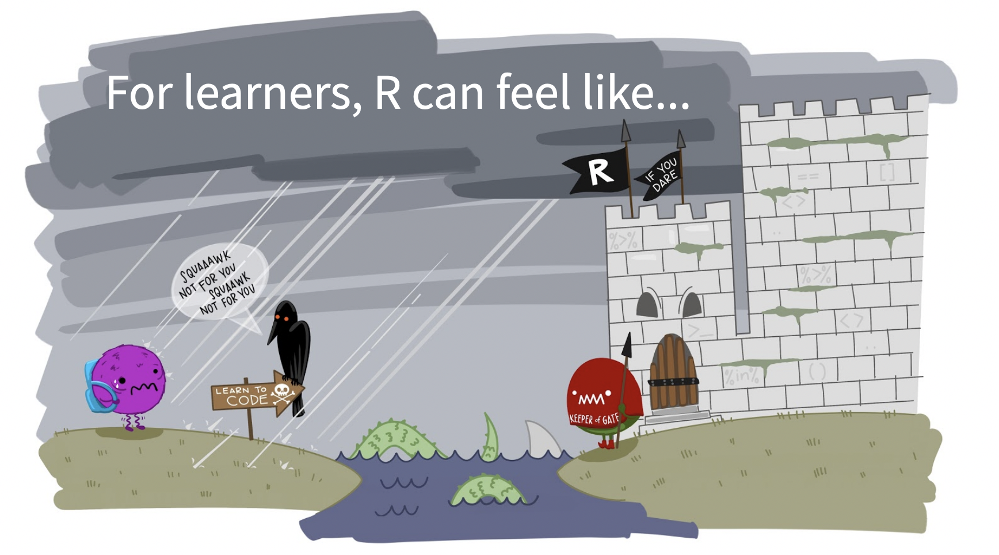
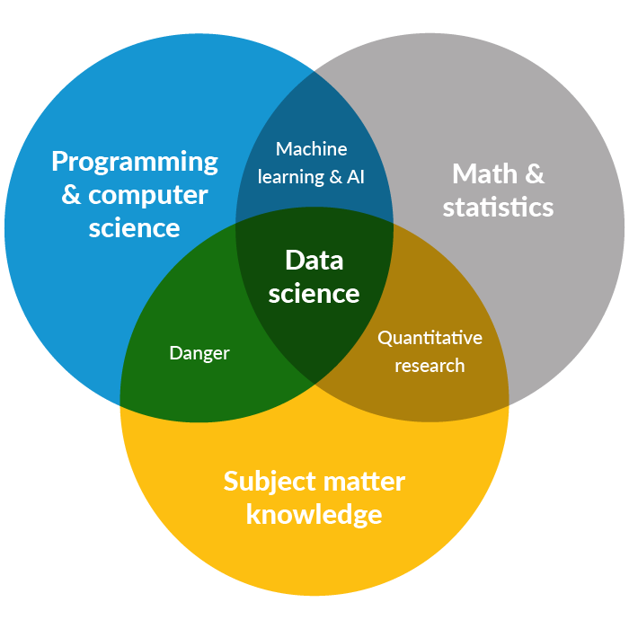

# Hello! 

## A little about me:

- `r emo::ji("leaf")` Assistant Teaching Professor - Environmental Data Science
- `r emo::ji("teacher")` 10 years teaching in R (introductory & advanced courses)
- `r emo::ji("ocean")` Bren & UCSB students from diverse backgrounds
- `r emo::ji("palette")` RStudio Artist-in-Residence (2019 - 2020)
- `r emo::ji("apple")` Workshops in industry, academia, learning communities

---

class: middle 

## Random tip 1: add emoji in R Markdown

Use the [emo](https://github.com/hadley/emo) package to add emoji in R Markdown.

```{r}
emo::ji("penguin")
```

Use `View(jis)` to check out all the specific emoji names. 

---

# Why this talk?

- `r emo::ji("graph")` Data science / coding skills ubiquitously valuable
- `r emo::ji("teacher")` Instructors and TAs incorporating R into courses
- `r emo::ji("skull")` Teaching R (or any programming) can be a beast
- `r emo::ji("+1")` A lot of things that are useful for teaching are also useful for data analysis, communication & more 

**Important:** There are *many* good ways to teach R & data science. Pick what works well for you and your students! 

---

# 4-3-2-1...go outline!

- ### `r emo::ji("four")` strategies to welcome hesitant students

- ### `r emo::ji("three")` tools to make your life easier 

- ### `r emo::ji("two")` platforms to minimize installation barriers

- ### `r emo::ji("one")` lesson learned 

```{r, echo = FALSE, out.width = "20%", fig.align = "center"}

```

---

class: inverse

# `r emo::ji("four")` strategies to welcome hesitant students

```{r, echo = FALSE, fig.align = "center", out.width = "80%"}

```


---

## First interaction with R?

```{r}
vec <- c(1, 5, 10, 20)

vec[2]
```

```{r}
calc_volume <- function(moles, R, temp, pressure) {
  (moles * R * temp) / pressure 
}
```

## `r emo::ji("vomit")`

---

class: inverse

## 1. Create early wins

```{r, echo = FALSE, out.width = "50%", fig.align = "center"}
knitr::include_graphics("welcome_to_rstats.png")
```

---

class: left, middle

"On the first day of the course...students are presented with a fully functional R Markdown document...that they can knit to produce an in-depth data visualization. Then, **by updating just one parameter in the R Markdown document, they can produce a new report with a new data visualization**."

*From* [A Fresh Look at Introductory Data Science](https://www.tandfonline.com/doi/full/10.1080/10691898.2020.1804497) *by Mine Cetinkaya-Rundel and Victoria Ellison,  Journal of Statistics and Data Science Education (Vol. 29, 2021)*

---

class: inverse

## 2. Engage more students with creative activities

```{r, out.width = "50%", fig.align = "center", echo = FALSE}
knitr::include_graphics("rstudio-artist.jpg")
```


---

class: center, top, inverse

```{r, out.width = "45%", echo = FALSE}

```

.footnote[
From the [Data Science at the Urban Institute](https://urban-institute.medium.com/what-is-data-science-the-urban-institute-b5e4b3ff9cc2)
]

---

## Example Activity 1: Do your data viz worst

```{r, echo = FALSE, out.width = "60%", echo = FALSE, fig.align = "center", fig.cap = "By Jessica West, Bren MESM Class of 2023"}

```

---
```{r eval = FALSE}
ggplot(data = space, aes(x = agency, y = launch_year)) +
  annotation_custom(rasterGrob(img, width = unit(1,"npc"), height = unit(1,"npc")), 
                    -Inf, Inf, -Inf, Inf) +
  geom_point() +
  theme(
    plot.background = element_rect(fill = "yellow"),
    plot.title = element_text(size = 30, hjust = 0.25),
    plot.subtitle = element_text(size = 20, hjust = 0.75, color = "red", family = "serif"),
    plot.caption = element_text(size = 10, face = "italic", angle = 25),
    axis.title.x = element_text(face = "bold.italic", color = "blue"),
    axis.title.y = element_text(family = "mono", face = "bold", size = 20, hjust = 0.25),
    axis.text = element_text(face = "italic", size = 15),
    axis.text.x.bottom = element_text(angle = 180),
    panel.background = element_rect(fill = 'lightblue', colour = 'darkred', size = 4),
    panel.border = element_rect(fill = NA, color = "green", size = 2),
    panel.grid.major.x = element_line(color = "purple", linetype = 2),
    panel.grid.minor.x = element_line(color = "orange", linetype = 3),
    panel.grid.minor.y = element_blank(),
    strip.background = element_rect(fill = "magenta"),
    strip.text.y = element_text(color = "white"),
    strip.placement = "outside") +
  labs(x = "Agency", 
       y = "Y", 
       title = "Agency L@unch D@tes",
       subtitle = "Some time before today",
       caption = "Data source: Space Force?")
```

---

## Example Activity 2: Make some aRt

For example, Danielle Navarro's {flametree} package:

```{r}
library(flametree)

dat <- flametree_grow(time = 7, trees = 15)

p <- dat %>% 
  flametree_plot(
    background = "gray10",
    palette = c("antiquewhite", "coral", "cyan4", "goldenrod"), 
    style = "nativeflora"
  )
```

---

class: inverse, center, middle

```{r, echo = FALSE, fig.width = 16}
p
```

---

class: inverse

## 3. Help them personalize their kitchen

```{r, out.width = "60%", fig.align = "center", echo = FALSE}
knitr::include_graphics("decorate-r.jpg")
```

---


## Minimal effort, big impact ideas:

- Update IDE theme `r emo::ji("paintbrush")`
- R Markdown + visual editor `r emo::ji("eyes")`
- Rainbow parentheses `r emo::ji("rainbow")`
- R Projects for easier file paths


---

## Random tip 2

## ...wait you AREN'T using rainbow parentheses?

In RStudio (version >= 1.4): *Tools > Global Options > Code > Display > Rainbow parentheses*

```{r, echo = FALSE, out.width = "90%"}
knitr::include_graphics("rainbow-parentheses.png")
```


---


## 4. Write code together

- You talk, ask & type, then they type - bit by bit
- Bring annotated key for yourself! 
- Make keys available* before and after for everyone

\*Keep this in mind in the next section of the talk! 

---

### Talking through code: example

How might I teach this code with beginners who have been **exposed** to these functions, but who will absolutely not in any universe remember how to write them out for at least several weeks?  

```{r}
library(tidyverse)
library(palmerpenguins)

chinstrap <- penguins %>% 
  filter(species == "Chinstrap") %>% 
  mutate(body_mass_kg = body_mass_g / 1000) %>% 
  rename(season_start = year)
  
```

---

## Random tip 3: penguins with a purpose! 

.pull-left[
```{r, echo = FALSE, out.width = "60%", fig.align = "center"}
knitr::include_graphics("palmerpenguins.png")
```
]

.pull-right[

<font size=5.5>
The <i>iris</i> dataset was published by RA Fisher in <i>The Annals of Eugenics</i> (1936). The penguins data in the {palmerpenguins} R package is a near drop-in replacement, plus: 

<ul>
  <li> No eugenics history
  <li> Recent data (2007 - 2009) by Dr. Kristen B. Gorman
  <li> Unequal sample size + some missing values
  <li> Complete metadata
</ul>

</font>
]

Learn more! [allisonhorst.github.io/palmerpenguins/](https://allisonhorst.github.io/palmerpenguins/)

---

## Also comes with art + pictures! 

"Everybody loves penguins." - Dr. Kristen Gorman

.pull-left[

```{r, echo = FALSE, out.width = "100%", fig.align = "center"}
knitr::include_graphics("penguins.png")
```
]

.pull-right[

```{r, echo = FALSE, out.width = "100%", fig.align = "center"}

```

]

See [more photos](https://docs.google.com/presentation/d/1DFJLXYRJ2kWw6AFkJu7MclFPr8zkqD-PHh5bs4xcr3Y/edit) of the Palmer Archipelago penguins!

---

# 4-3-2-1...go outline!

- ### `r emo::ji("four")` strategies to welcome hesitant students `r emo::ji("check")`

- ### `r emo::ji("three")` tools to make your life easier 

- ### `r emo::ji("two")` platforms to minimize installation barriers

- ### `r emo::ji("one")` lesson learned 

```{r, echo = FALSE, out.width = "20%", fig.align = "center"}

```


---

## `r emo::ji("three")` tools that might make your life easier

1. `r emo::ji("swirl")` [{xaringan}](https://github.com/yihui/xaringan) for slides
2. `r emo::ji("computer")` [GitHub Pages](https://pages.github.com/) to share materials
3. `r emo::ji("book")` Use existing educational resources

---

## [{xaringan}](https://github.com/yihui/xaringan) by Yihui Xie

### /ʃaː.'riŋ.ɡan/

Slides with code and outputs, easily updated & shared.

### (...because copying and pasting screenshots of code is a tedious bummer that doesn't model good practices for reproducibility & automation)

---

## These slides are all made in R Markdown

Let's see how! 

```{r, eval = FALSE}
install.packages("xaringan")
```

New R Markdown > From Template > Xaringan > `r emo::ji("knit")` !

---

## 2. [GitHub Pages](https://pages.github.com/) to share lab keys

### `r emo::ji("tired")` Tired: Save, upload, edit, delete, reupload, repeat.

### `r emo::ji("excited")` Wired: Edit, push.

---

## Using GitHub pages to make any .Rmd a web page

In a GitHub repo named `bananas` (owned by user "giraffe"), enable GitHub pages, choose source (Settings > Pages > from branch):

- A file named `index.html` will be live at `giraffe.github.io/bananas`
- Any other html will be published with file name as an added slug (e.g. `giraffe.github.io/bananas/taco.html`)

---

## So if your repo looks like this: 

```{r, echo = FALSE, out.width = "70%"}

```

---

## And you've done this:

Settings > Pages > (update source)

```{r, echo = FALSE, out.width = "80%"}

```

---

## Then those .htmls will be live at:

- `username.github.io/repo-name` 
- `username.github.io/repo-name/file-name.html` 

For the examples shown on previously slides (username = "allisonhorst", repo name = "gh-pages-demo") and with two files, index.html and demo-key.html, those will be published respectively at: 

- allisonhorst.github.io/gh-pages-demo/
- allisonhorst.github.io/gh-pages-demo/demo-key.html

---

## 3. Use existing teaching materials

- [{swirl}](https://swirlstats.com/) package to "learn R, in R" with existing lessons, or you can modify / create your own lessons! 
- Tutorials in RStudio
- [Data science in a box](https://datasciencebox.org/index.html) by Mine Cetinkaya-Rundel
- [The big book of R](https://www.bigbookofr.com/) by Oscar Baruffa
- [R for Excel Users](https://rstudio-conf-2020.github.io/r-for-excel/) 2-day workshop by Lowndes & Horst

---

# 4-3-2-1...go outline!

- ### `r emo::ji("four")` strategies to welcome hesitant students `r emo::ji("check")`

- ### `r emo::ji("three")` tools to make your life easier `r emo::ji("check")`

- ### `r emo::ji("two")` platforms to minimize installation barriers

- ### `r emo::ji("one")` lesson learned 

```{r, echo = FALSE, out.width = "20%", fig.align = "center"}

```

---

## `r emo::ji("two")` platforms to minimize installation barriers

- {learnr}
- RStudio Cloud

---

## [{learnr}](https://rstudio.github.io/learnr/)

"The learnr package makes it easy to turn any R Markdown document into an interactive tutorial. Tutorials consist of content along with interactive components for checking and reinforcing understanding. 

Tutorials automatically preserve work done within them, so if a user works on a few exercises or questions and returns to the tutorial later they can pick up right where they left off."

---

## Example learnr tutorial

Missing data tutorial: https://allisonhorst.shinyapps.io/missingexplorer/

```{r, echo = FALSE, out.width = "60%", fig.align = "center"}

```

---

Include activities, examples, quizzes, hints, videos and more!

```{r, echo = FALSE, out.width = "80%", fig.align = "center"}

```

See a bunch of other examples here: https://rstudio.github.io/learnr/

---

## You can make one too! 

- Install the {learnr} package
- New file > R Markdown > From Template > Interactive Tutorial

```{r, echo = FALSE, out.width = "40%", fig.align = "center"}

```

---

## RStudio Cloud

- Share materials in an R project with a link! 
- No git / GitHub needed

"RStudio Cloud is a hosted version of RStudio in the cloud that makes it easy for professionals, hobbyists, trainers, teachers and students to do, share, teach and learn data science using R.

Create your analyses using RStudio directly from your browser - there is no software to install and nothing to configure on your computer."

### Let's check it out! 

---

### Don't miss out on the [RStudio Cloud primers](https://rstudio.cloud/learn/primers)

```{r, echo = FALSE, fig.align = "center", out.width = "75%"}

```


---

# 4-3-2-1...go outline!

- ### `r emo::ji("four")` strategies to welcome hesitant students `r emo::ji("check")`

- ### `r emo::ji("three")` tools to make your life easier `r emo::ji("check")` 

- ### `r emo::ji("two")` platforms to minimize installation barriers `r emo::ji("check")`

- ### `r emo::ji("one")` lesson learned 

```{r, echo = FALSE, out.width = "20%", fig.align = "center"}

```

---

## `r emo::ji("one")` big lesson learned

### Curiosity and resourcefulness are learning outcomes.

```{r, echo = FALSE, out.width = "40%", fig.align = "center"}

```

---

# 4-3-2-1...done!

- ### `r emo::ji("four")` strategies to welcome hesitant students `r emo::ji("check")`

- ### `r emo::ji("three")` tools to make your life easier `r emo::ji("check")` 

- ### `r emo::ji("two")` platforms to minimize installation barriers `r emo::ji("check")`

- ### `r emo::ji("one")` lesson learned `r emo::ji("check")`

```{r, echo = FALSE, out.width = "20%", fig.align = "center"}

```

---

class: inverse, center

## Some teachers I learn from: 

[Mine Cetinkaya-Rundel](https://mine-cr.com/) | [Tiffany Timbers](https://www.tiffanytimbers.com/) | [Julia Lowndes](https://jules32.github.io/) | [Jenny Bryan](https://jennybryan.org/) | [Alison Hill](https://www.apreshill.com/) | [Greg Wilson](https://third-bit.com/) | [Kelly Bodwin](https://www.kelly-bodwin.com/) ... + many more

# I welcome you to reach out! 

ahorst@ucsb.edu | @allison_horst | www.allisonhorst.com

## Thank you QMSS!